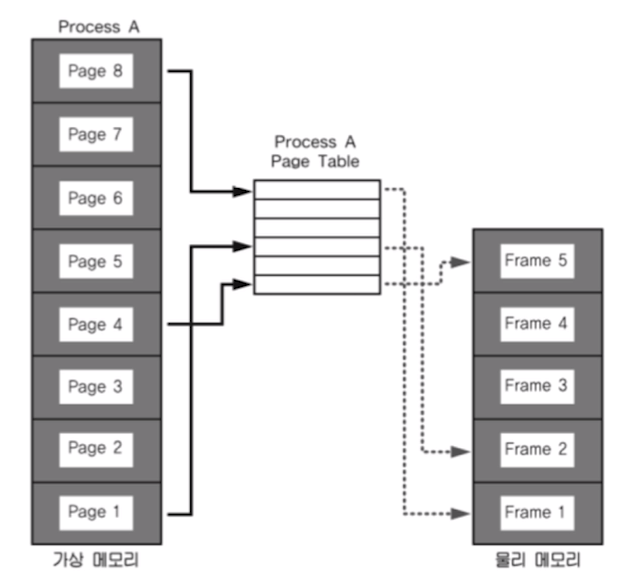

# 1. 운영체제

## 1.5. 가상 메모리

### 1.5.1. 가상 메모리 개념

- 배경
  - 실제 각 프로세스 마다 충분한 메모리를 할당하기에는 메모리 크기 한계가 있음
  - 예를 들면 리눅스는 하나의 프로세스가 4GB
  - 따라서, 어떻게하면 적은 메모리로 여러 프로세스를 실행 시킬 수 있도록 구조를 가져갈지 고민
- 필요 이유
  - 가상 메모리 없으면 하나의 프로세스만 실행 가능한 시스템임 (배치 처리 시스템 등)
  - 여러 프로세스 동시 실행 시스템은  아래 이슈 발생
    - 이슈
      - 메모리 용량 부족 이슈 발생
      - 프로세스 메모리 영역 간 침범 이슈
    - 따라서 가상 메모리 필요
- 기술 설명
  - 메모리가 실제 메모리보다 많아 보이게 하는 기술
    - 실제 사용하는 메모리는 작다는 점에서 착안
      - 예를 들어, 프로세스에 4GB를 할당하나 실제 물리 메모리에 올라가는 것은 그것보다 작음
    - 프로세스간 공간 분리로 프로세스 이슈가 전체 시스템에 영향 주지 않음
- 특징
  - 
  - 프로세스는 가상 주소를 사용하고, 실제 해당 주소에서 데이터를 읽고 쓸때만 물리 주소로 바꿔주면 된다
    - virtual address (가상 주소): 프로세스가 참조하는 주소
    - physical address (물리 주소): 실제 메모리 주소
    - 가상주소를 물리주소로 변환시켜주는 메커니즘이 들어있음
      - MMU(Memory Management Unit) 이라는 하드웨어 장치가 수행
      - 

### 1.5.2 페이징 시스템

- 가상 메모리 만들기 위해 가장 많이 쓰이는 메커니즘

- 개념

  - 크기가 동일한 페이지로 가상 주소 공간과 이에 매칭하는 물리 주소 공간을 관리
  - 하드웨어 지원 필요 - 인텔 32bit 시스템에서는 4KB, 2MB, 1GB 단위 지원
  - 리눅스에서는 4KB로 페이징
  - 페이지번호로 가상 주소 / 물리 주소 매핑 정보를 기록하고 사용함

- 예시

  - 프로세스(4GB)의 PCB(process control block)에 Page Table 구조체를 가리키는 주소 있음
  - Page Table에는 가상 주소와 물리 주소간 매핑 정보 있음
  - 

- 구조

  - page 또는 page frame: 고정된 크기의 block (4KB)

    (참고) 프로세스 단위 (4GB = 2^32 in 32bit 시스템)

  - 가상 주소 v = (p, d)

    - p: 가상 메모리 페이지 (페이지 번호)
    - d: 페이지 처음부터 얼마 떨어진 위치인지 (변위)

  - 가상 페이지 번호 p가 Page Table에 물리주소 번호와 매핑이 되고, 이 물리주소 번호에 변위 d 만큼 더하면 실제 물리 메모리 주소가 되는 것임 

  - 

- Page Table

  - 물리 주소에 있는 페이지 번호와 해당 페이지의 첫 물리 주소 정보 매핑한 표

  - CPU가 해당 프로세스에서 특정 가상 주소 엑세스 하려면

    - 해당 프로세스의 page table에 해당 가상 주소가 포함된 페이지 번호(p)가 있는지 확인

    - 페이지 번호가 있으면 이 page가 매핑된 물리주소를 알아내고(p')

    - p' + d가 실제 물리 메모리의 데이터위치(주소) 가 됨

      (정리) 프로세스 PCB에 page table의 base주소 가져오기 + 페이지번호를 가지고 Page Table에서 해당 Page로 들어갈 수 있음

  - 

  - Page Table에는 valid-invalid bit 가 있어서 물리 주소에 데이터가 들어있는지 비어있는지도 알 수 있음

  - 

- 페이징 시스템과 MMU

  - 프로세스 생성 시 페이지 테이블 정보 생성
  - PCB 등에서 해당 페이지 테이블 접근 가능하고, 관련 정보는 물리 메모리에 적재
  - 프로세스구동시, 해당 페이지 테이블 base 주소가 별도 레지스터에 저장 (CR3)
  - CPU가 가상 주소 접근 시, MMU가 페이지 테이블 base 주소를 접근해서 물리 주소를 가져온다.

### 1.5.3  다중 단계 페이징 시스템

- 페이징 정보를 단계를 나누어서 생성한다. 즉 필요없는 페이지는 생성하지 않으면 공간 절약 가능
  - 페이지 디렉토리를 만들고 정말 데이터가 있는 영역에 대해서만 페이지 테이블 만들어서 공간절약가능
  - 페이지 번호를 나타내는 bit 를 구분해서, 단계를 나눔 (리눅스는 3단계, 최근 4단계)
  -    
  - 순서
    1. CR3 레지스터의 전체 Page Table 맨앞이 결과적으로 Page Directory 맨앞을 가리킴
    2. Page Directory 의 맨 앞에서부터 해당 주소의 대응하는 디렉토리로 가고, 해당 디렉토리에 대한 Page정보를 가지고 있는 Page Table의 맨 앞으로 감
    3. Page Table에서 해당 Page 번호를 찾아서 offset 번호를 가지고 물리 주소의 데이터를 가져옴
  - MMU 동작 과정 최종 정리
    - 
    - 메모리계층에 따르면 레지스터 처리 시간 대비 메인메모리에 갔다오는 시간이 상당히 큼
      - 별도의 하드웨어 캐쉬를 만든다 (TLB)
      - 
      - TLB(Translation Lookaside Buffer): 페이지 정보 캐쉬에 최근에 변환된 물리주소로 변환된 가상주소를 확인
        - 
      - 특징
        - 페이징 시스템은 공유메모리를 통해 물리 메모리를 효과적으로 사용 가능  
          - 프로세스A와 프로세스B가 동일한 물리주소를 가리킬 수 있음(공간절약, 메모리 할당시간 절약)
            - 예시1) 프로세스 내 커널공간(1GB)은 다 동일한 물리 메모리 주소를 가르킴
          - Parent Process - Child Process 관계에서
            - READ 요청일 때: 프로세스를 복사하는 것이 아니라 A의 프로세스 테이블과 B의 프로세스 테이블 모두 같은 물리 주소를 가리킴
            - WRITE 요청일 때: 프로세스 A만 물리 주소에 쓰기하고 B는 복사해서 페이지 포인터 변경
            - 장점) 공간 공유로 인한 공간 절약 및 프로세스 생성 시간 단축 가능
            - 
    

### 1.5.4 요구 페이징

- 설명
  - 프로세스 모든 데이터를 메모리로 적재하지 않고, 실행 중 필요한 시점에서만 메모리로 적재함
    - 선행 페이징의 반대 개념 --> 현실성이 없음
    - 더이상 필요하지 않은 페이지 프레임은 다시 저장매체에 저장 (페이지 교체 알고리즘 필요)
    - Page Table의 invalid bit를 보고 물리 메모리에 올린 후 Page Table 업데이트
- 페이지폴트 인터럽트
  - 어떤 페이지가 실제 물리 메모리에 없을 때 일어나는 인터럽트
  - 운영체제가 해당 페이지를 물리메모리에 올림
  - 요구페이징을 지원하는 메커니즘
  - HW와 운영체제 전체 메커니즘
    - 
    - 페이지폴트가 자주 일어나면 실행 시간이 아주 오래 걸림
      - 페이지 폴트 최소화 보완 하기 위한 알고리즘 필요! --> 페이지 교체 알고리즘

### 1.5.5 페이지 교체 알고리즘

- FIFO
  - 요구 페이징 기법에서 가장 간단한 정책
  - 물리 메모리에서 가장 먼저 들어온것 먼저 교체
- OPT (Optimal)
  -  가장 오랫동안 사용하지 않을 페이지 교체 --> 최적해이지만, 실현이 불가능한 알고리즘
  - OPT와 유사하게 구현하기 위해 아래 알고리즘들이 나옴
    - **LRU (Least Recently Used)** <- 가장 많이 쓰임
      - 과거 기록을 기반으로 사용
      - 가장 오래 전에 사용된 페이지를 교체
    - LFU (Least Frequently Used)
      - 가장 적게 사용된 알고리즘을 교체
    - NUR (Not Used Recently)
      - LRU처럼 최근에 사용하지 않은 페이지부터 교체
      - 페이지마다 참조비트(R), 수정비트(M) 있음 (R,M)
        - ex) (0,0), (0,1), (1,0), (1,1) 순으로 교체
        - 
    - 로컬리티
      - 메모리는 코드의 주변을 사용할 가능성이 높다 --> 따라서 가장 오래 전에 사용된 페이지는 지금은 사용되지 않을 가능성이 높으므로, LRU가 가장 OPT와 유사한 성능을 보일 확률이 높다
    - 스레싱 현상
      - 반복적으로 페이지 폴트가 발생해서 과도하게 페이지 교체 작업이 일어나, 실제로는 아무일도 하지 못하는 상황. 즉 페이지 폴트/스왑만 하다보니 실제 일처리 못함
      - 너무 많은 프로그램을 띄우지 말거나, 추가 메모리 구매

### 1.5.6 세그멘테이션 기법

- 가상 메모리를 서로 크기가 다른 논리 단위인 세그먼트로 분할 (페이지는 동일한 크기의 가상 블록)
- 종류
  - Code Segment, Data Segment, Stack Segment, Extra Segment로 나누어서 메모리 접근
- 세그먼트 가상 주소: v = (s, d)   <-- 거의 페이징 기법과 유사함
- 세그먼테이션은 크기가 다른 Segment 다뉘로 물리 메모리에 로딩
- 
- 참고
  - 내부 단편화
    - 페이지 블록 만큼 데이터가 딱 맞게 채워져있지 않아서 생기는 공간 낭비
  - 외부 단편화
    - 물리 메모리가 원하는 연속된 크기의 메모리를 제공하지 못해서 생김
  - 리눅스는 거의 페이징 기법만 사용: 다양한 컴퓨터 시스템에 이식성을 중요 시 여기기 때문

### 1.5.7 가상 메모리 동작 총정리

- Lazy Allocation 개념 (최대한 할당 지연)

  - 디스크에 있는 실행파일을 물리 메모리까지 올리는 것은 상당한 시간이 걸리므로 정말 실행이라는 명령어가 떨어지기 전까지는 최대한 할당 지연

  1. 실행파일 in 디스크
  2. 가상메모리화
  3. 해당 데이터 필요 시점 이전까지는 어느 데이터도 물리 데이터에 넣지 않음 (지연)
  4. (실행 시점이 되면) 페이지(물리메모리) <-- 요구페이징 기법 사용
  5. 페이지 폴트 시 디스크의 코드를 물리 메모리에 올리고 페이지테이블 업데이트
  6. 다시 CPU에게 실행 명령